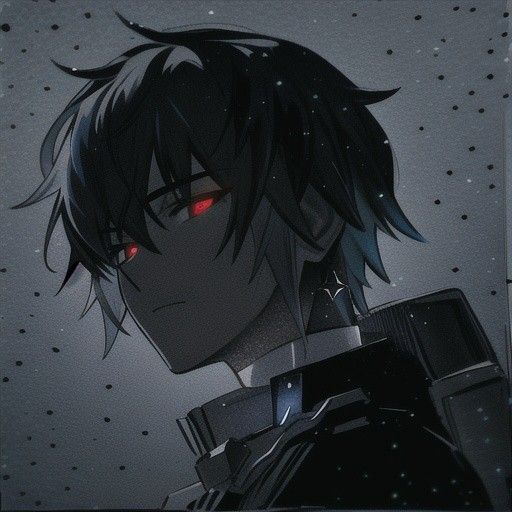

# Welcome to My Github
- Name : **Muhammad Khoirul Huda**
- Class : **XI**
- School : **SMKN 1 Gedangan**

 

## What I Learned?
- C++
- PHP
- MYSQL
- HTML
- Pascal
- Maybe Python For The Next

## What I do now?
- Learn About **CyberSecurity**

